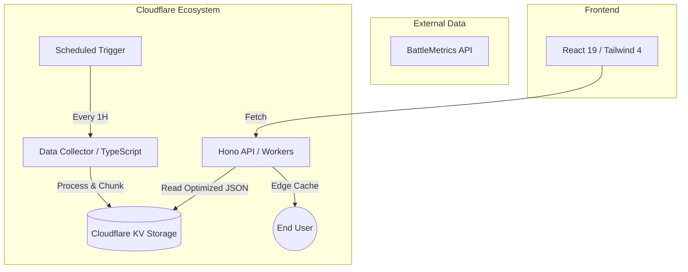

# 🛡️ Arma Mods Leaderboard (reforgermods.com)

A high-performance mod tracking and ranking platform for **Arma Reforger** and **Arma 3**. This project addresses the limitations of the official Arma Workshop by providing real-time popularity metrics based on active server and player statistics.

---

## 🚀 Key Engineering Highlights

- **AI-First Development**: Architected and optimized using advanced LLM orchestration (Claude/Qwen), ensuring high code quality, performance-tuned logic, and rapid delivery of complex features.
- **Ultra-Low Latency API**: Built with **Hono** and deployed on **Cloudflare Workers**, leveraging **Edge Caching** to achieve sub-10ms response times globally.
- **Scalable Data Architecture**: Designed a custom multi-layered storage system using **Cloudflare KV**, utilizing **chunking strategies** to bypass 25MB value limits while maintaining O(1) lookup performance.
- **Intelligent Ranking Algorithm**: Developed a hybrid scoring system that weights player counts, server adoption, and historical trends to provide a more accurate popularity index than simple "likes".
- **Unified Multi-Game Architecture**: Support for both **Arma Reforger** and **Arma 3** within a single, context-aware dashboard, featuring a tactical game switcher for seamless cross-platform intelligence.
- **Production-Ready Frontend**: A modern, SEO-optimized **React 19** dashboard featuring a "tactical-industrial" aesthetic, custom design system, and in-memory caching for near-instant user experience.

---

## 🏗️ Architecture Overview

---

## 🛠️ Technology Stack

| Layer | Technologies |
| :--- | :--- |
| **Frontend** | React 19, Vite, Tailwind CSS 4, Recharts, TypeScript |
| **Backend / API** | Hono, Node.js, Cloudflare Workers |
| **Infrastructure** | Cloudflare Pages, Cloudflare KV, Cron Triggers |
| **Data Processing** | TypeScript, Axios, BattleMetrics API |

---

## 📈 Optimization Strategies

### 1. Ultra-Optimization (Text-Targeted Search)
To avoid the CPU overhead of parsing massive JSON objects in a serverless environment, the API utilizes a specialized string-based search strategy, ensuring the Worker stays well within the 10ms-50ms CPU execution limits.

### 2. Distributed KV Storage
Data is automatically sharded into blocks (chunks) of 500 entries. This allows the system to scale indefinitely while keeping individual KV reads fast and cost-effective.

### 3. Edge-First Delivery
By implementing strict `Cache-Control` policies and leveraging the Cloudflare Global Network, mod data is served from the user's nearest data center, minimizing TTFB (Time To First Byte).

---

## 🛠️ Local Development

1. **Clone the repository**
2. **Install dependencies**: `npm install && cd web && npm install`
3. **Environment setup**: Copy `.env.example` to `.env` and fill in your BattleMetrics API Key.
4. **Run Dev Servers**:
   - Backend Proxy: `npm run dev`
   - Frontend: `cd web && npm run dev`

---

## 📝 License

Copyright © 2026 Saulėspro. Distributed under the [CC BY-NC 4.0](https://creativecommons.org/licenses/by-nc/4.0/) license. For commercial inquiries, contact info@saulespro.lt.

